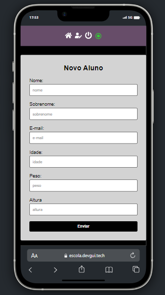
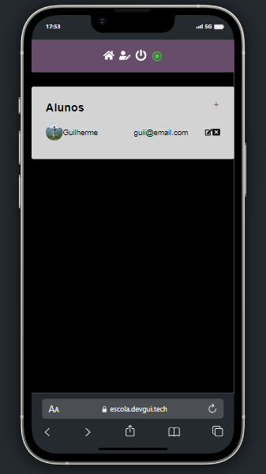
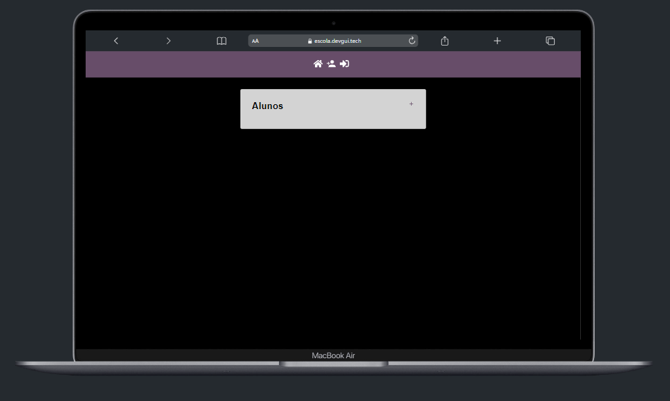
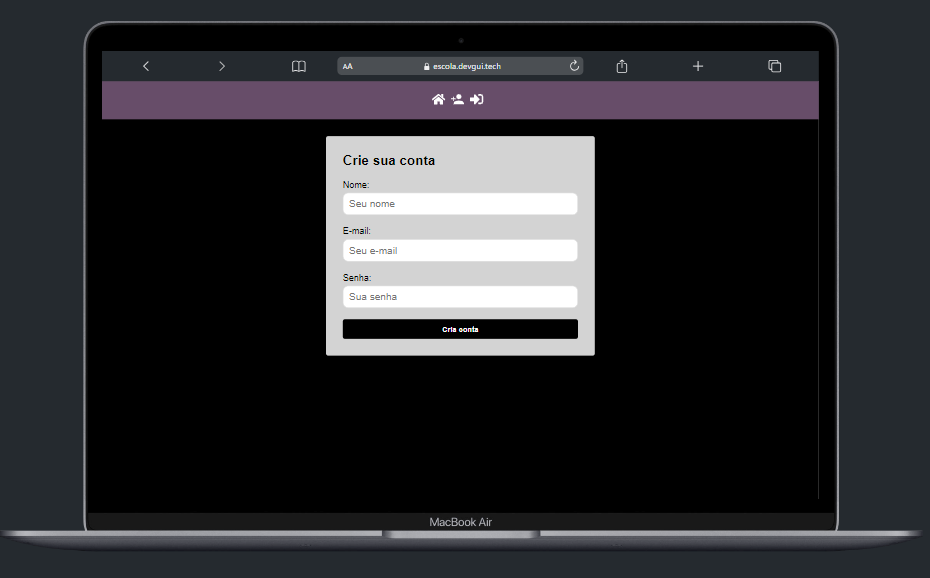

# Projeto Escola
[](https://github.com/GuilhermeHenrii/App-Escola/blob/main/LICENSE)

# Sobre o projeto
https://escola.devgui.tech/

Esse repositório foi criado com o objetivo de apresentar, documentar e armazenar os códigos do projeto Escola.

Esta aplicação web simula o que seria um sistema de gerenciamento de alunos em uma escola, armazenando seus dados como altura, idade, nome etc. Nesse repositório, você encontrará, basicamente, o consumo da uma Api Rest também criada por mim, que se encontra no seguinte local: https://github.com/GuilhermeHenrii/Api_Rest_Escola.

Nesse projeto eu criei um sistema de login com email e senha. Após logar, o usuário pode apagar, criar ou editar um aluno, usei o react-redux para verificar o estado do JWT do usuário logado, para autorizar suas requisições pela aplicação. A criação do usuário consiste em um formulário simples com alguns campos como nome, sobrenome, idade etc, o diferencial fica por conta da possibilidade do usuário enviar uma imagem para a ciração do perfil de tal aluno. Usei a lin Multer para a criação do endpoint para o tratamento dessa imagem. Caso o usuário não possua uma conta, ele poderá criar facilmente com um nome de usuário, email e uma senha.

Usei o FrameWork React para consumir a api, foi bem fácil e simples o comsumo, o React fornece muitas ferramentas e funcionalidades para tal. Posso destacar desse projeto, o uso do React Hook UseEffect, que nos permite tratar efeitos colaterais no componente para uma melhor renderização e consumo dos dados. Destaco também o uso do react-redux, redux-saga e o redux-persist, com esse combo de tecnologias, a facilidade que temos de alterar e manipular, dentro de todo o sistema um estado é surpreendentemente eficaz.

Sinta-se avontade para fazer suas alterações no projeto e/ou entrar em contato comigo para falarmos sobre o mesmo, será um prazer.

Existem várias tecnologias e ferramentas que eu poderia destacar aqui, como o toastfy, styled-componentes etc, mas eu ficaria horas aqui digitando rsrs.

No mais é isso, obrigado por tirar um tempo para ver meu projeto! Até mais.
## Layout mobile
 

## Layout web




# Tecnologias utilizadas

- HTML / CSS / JS / TypeScript
- ReactJS
- Redux
- Slyded-Components

# Como clonar o projeto

Pré-requisitos: npm / yarn

```bash
# clonar repositório
git clone https://github.com/GuilhermeHenrii/Api_Rest_Escola.git

# entrar na pasta do projeto front end web
cd Aplicacao-Aluno-Consumo-Api-Rest

# instalar dependências
yarn install

# Lembrando que para executar o projeto e ter conexão com banco de dados
# você deve clonar também a Api Rest, e criar uma nova tabela para você ter acesso
# e poder manipular a aplicação como quiser

# executar o projeto
yarn start
```

# Autor

Guilherme Henrique da Silva Lopes

https://www.linkedin.com/in/guilherme-henrique-7aab6b229/
